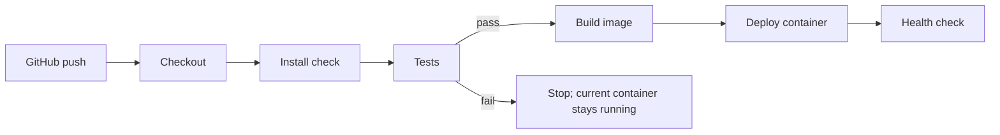
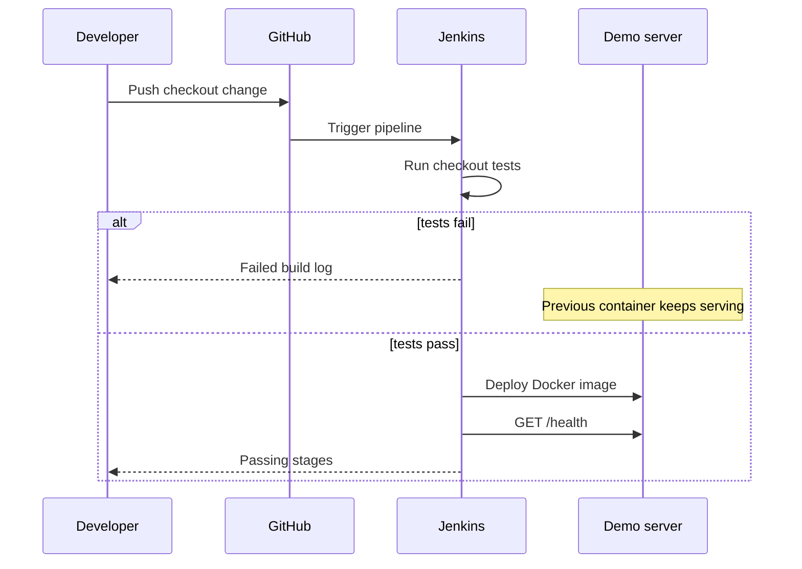

# Jenkins CI/CD checkout demo

This repository accompanies a class proposal about preventing broken checkout deployments with Jenkins. The assignment presentation is Wednesday, 23 September 2026. The demo uses Node's built-in HTTP and test modules, so local runs need no package download. The proposal described React and Express; this runnable classroom implementation uses a simpler Node API and browser page to keep the failure demonstration focused on the pipeline.

## Run on GitHub

After this repository is pushed to GitHub, open **Code > Codespaces > Create codespace on main**. Codespaces runs the tests and build during setup, starts the app, and forwards port 3000. Open the **Checkout demo** forwarded port to use the browser page. If the page has not appeared yet, run `npm start` in the Codespace terminal and open port 3000.

The **Checkout demo CI** workflow in `.github/workflows/ci.yml` runs on every push and pull request, and can also be started from **Actions > Checkout demo CI > Run workflow**. It tests the API, builds the assets and Docker image, then checks the running container's `/health` endpoint. The workflow validates the GitHub version of the code; the Jenkinsfile remains the separate Jenkins deployment demonstration for class.

## Run locally

Requires Node.js 20 or newer.

```sh
npm test
npm run build
npm start
```

Open `http://localhost:3000`, or try:

```sh
curl -s -X POST http://localhost:3000/api/checkout \
  -H 'content-type: application/json' \
  -d '{"quantity":2,"unitPrice":500,"stock":5}'
```

Expected result: `{"quantity":2,"total":1000,"remainingStock":3}`. Prices are integer cents.

## Jenkins setup

Create a Pipeline from SCM job pointing to this GitHub repository, with script path `Jenkinsfile`. Configure a Jenkins agent labelled `node-docker` with Node.js 20+, npm, Docker Engine, Docker Compose v2 and curl. Give that agent permission to use its local Docker daemon. Configure a GitHub webhook or use Jenkins polling to trigger a run on a push. The deployment is local to the Docker host on port 3000. The demo is not configured for a remote production server.

The stages are Checkout, Install, Test, Build, Deploy and Smoke test. The Install stage verifies Node/npm because this demo has no external dependencies. `disableConcurrentBuilds()` keeps two demo deploys from racing. A failing test skips later stages, leaving the current container in place.

## Ten-minute presentation demo

1. Show the currently running app and calculate a two-item order (1 minute).
2. Explain the pipeline and show the Jenkins stage view (2 minutes).
3. In `src/checkout.js`, temporarily change `quantity * unitPrice` to `unitPrice`. Run `npm test` to show the regression; commit and push the change to the demo GitHub repository (2 minutes).
4. Show Jenkins failing at Test. Build and Deploy are skipped; the running app still calculates the correct total (2 minutes).
5. Restore the correct multiplication, commit and push. Show all stages passing, including the health smoke test (2 minutes).
6. Close with limitations and questions (1 minute).

Do not leave the intentional defect in the final repository. Practice the two commits on a demo branch before class. Pushing to GitHub and operating Jenkins require accounts and infrastructure outside this workspace; this repository provides the code and configuration but does not claim an actual hosted run.

## Diagrams





Jenkins Pipeline behavior follows the [official Jenkins Pipeline handbook](https://www.jenkins.io/doc/book/pipeline/) and [Jenkinsfile guide](https://www.jenkins.io/doc/book/pipeline/jenkinsfile/).
